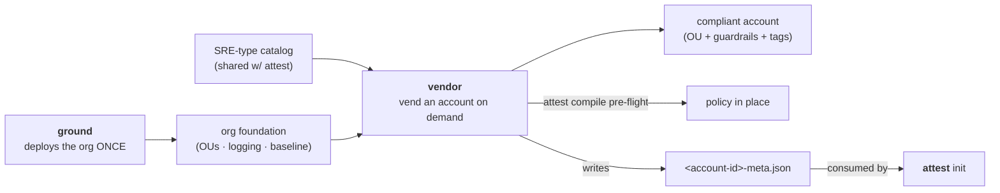

# vendor

**AWS account vendor for AWS Secure Research Environments.**

> **Boundary:** vendor **vends and configures accounts**; it makes **zero compliance claims**
> (attest does that, after `attest scan`). It is a **sibling to [ground](https://github.com/provabl/ground)**,
> not part of it — ground deploys the org foundation *once*; vendor supplies (vends) compliant
> **accounts on demand** into it, or into any org/OU you point it at.

Part of the [Provabl](https://provabl.dev) suite:
- **[ground](https://ground.provabl.dev)** — deploy the org foundation (once)
- **vendor** — vend compliant accounts into it (on demand) ← you are here
- **[attest](https://attest.provabl.dev)** — compile, enforce, and prove compliance
- **[qualify](https://qualify.provabl.dev)** — train and qualify researchers
- **[vet](https://vet.provabl.dev)** — verify the software supply chain
- **[steward](https://github.com/provabl/steward)** — govern data brought into the boundary

## What vendor does

Standing up a new SRE account by hand — correct OU, guardrails, data-class tags, a compliance
baseline — is exactly the click-ops drift the suite exists to prevent. The heavyweight answer is
AWS Control Tower / Account Factory for Terraform, which is genuinely overwrought for a research
institution standing up a handful of SREs (it wants a landing zone, a Service Catalog product, a
Terraform backend, and a CI pipeline first). vendor offers the 80% those SREs actually need: **one
binary, a shared SRE-type catalog, and a target parent.**



## Status

🚧 **Under active development** — building the AWS-free foundation first (catalog, meta I/O, the
provision/preflight orchestration behind seams), then the live account operations **adopt-first**:
the whole pipeline is validated against an *existing* account (`vendor adopt` — reversible) before
live `organizations:CreateAccount` is ever exercised, because an AWS account can only be *closed*
(90-day suspend), never deleted. Account closure (`vendor close`) is out of scope for v1.

Shipped so far:
- **`vendor catalog list` / `show`** — inspect the SRE-type catalog (frameworks, OU, tags, baseline
  stacks per type). The catalog schema is shared with attest (attest#98) via
  [`github.com/provabl/schemas`](https://github.com/provabl/schemas) — one schema, not two.

See `business/vendor-product-spec.md` (in the umbrella) and provabl epic #9 for the full roadmap.

## Install

```bash
go install github.com/provabl/vendor/cmd/vendor@latest   # requires Go 1.26.5+
# or build from a clone: go build ./cmd/vendor
```

## License

Apache 2.0. Copyright 2026 Playground Logic LLC.
