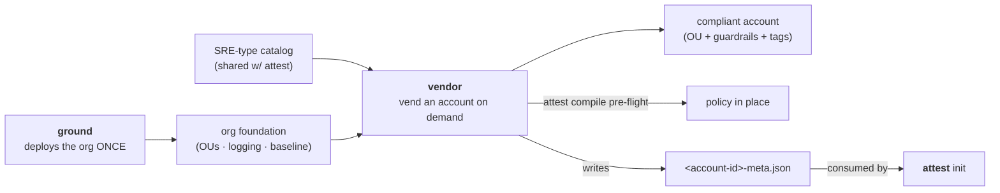

# vendor

**AWS account vendor for AWS Secure Research Environments.**

> **Boundary:** vendor **vends and configures accounts**; it makes **zero compliance claims**
> (attest does that, after `attest scan`). It is a **sibling to [ground](https://github.com/provabl/ground)**,
> not part of it — ground deploys the org foundation *once*; vendor supplies (vends) compliant
> **accounts on demand** into it, or into any org/OU you point it at.

Part of the [Provabl](https://provabl.dev) suite:
- **[ground](https://ground.provabl.dev)** — deploy the org foundation (once)
- **vendor** — vend compliant accounts into it (on demand) ← you are here
- **[attest](https://attest.provabl.dev)** — compile, enforce, and prove compliance
- **[qualify](https://qualify.provabl.dev)** — train and qualify researchers
- **[vet](https://vet.provabl.dev)** — verify the software supply chain
- **[steward](https://github.com/provabl/steward)** — govern data brought into the boundary

## What vendor does

Standing up a new SRE account by hand — correct OU, guardrails, data-class tags, a compliance
baseline — is exactly the click-ops drift the suite exists to prevent. The heavyweight answer is
AWS Control Tower / Account Factory for Terraform, which is genuinely overwrought for a research
institution standing up a handful of SREs (it wants a landing zone, a Service Catalog product, a
Terraform backend, and a CI pipeline first). vendor offers the 80% those SREs actually need: **one
binary, a shared SRE-type catalog, and a target parent.**


```mermaid
flowchart LR
    ground["<b>ground</b><br/>deploys the org ONCE"] --> org["org foundation<br/>(OUs · logging · baseline)"]
    catalog["SRE-type catalog<br/>(shared w/ attest)"] --> vendor["<b>vendor</b><br/>vend an account on demand"]
    org --> vendor
    vendor --> acct["compliant account<br/>(OU + guardrails + tags)"]
    vendor -->|"attest compile pre-flight"| policy["policy in place"]
    vendor -->|"writes"| meta["&lt;account-id&gt;-meta.json"]
    meta -->|"consumed by"| attest["<b>attest</b> init"]
```

## Status

🚧 **Under active development** — building the AWS-free foundation first (catalog, meta I/O, the
provision/preflight orchestration behind seams), then the live account operations **adopt-first**:
the whole pipeline is validated against an *existing* account (`vendor adopt` — reversible) before
live `organizations:CreateAccount` is ever exercised, because an AWS account can only be *closed*
(90-day suspend), never deleted. Account closure (`vendor close`) is out of scope for v1.

Shipped so far:
- **`vendor catalog list` / `show`** — inspect the SRE-type catalog (frameworks, OU, tags, baseline
  stacks per type). The catalog schema is shared with attest (attest#98) via
  [`github.com/provabl/schemas`](https://github.com/provabl/schemas) — one schema, not two.
- **`vendor preflight`** — check that the calling principal holds the AWS Organizations actions a
  vend needs, via read-only `iam:SimulatePrincipalPolicy`. Run it **before** `provision`. See
  [`docs/required-permissions.md`](docs/required-permissions.md).
- **`vendor adopt <account-id> --type <key>`** — retrofit an **existing** account to an SRE type:
  place it in the type's OU, apply its tags, run the `attest compile` pre-flight, write
  `<account-id>-meta.json`. **Reversible and idempotent** — the recommended way to validate the
  whole pipeline before `provision`, and the way to bring a hand-created account under management.
- **`vendor provision --type <key> --name … --email …`** — vend a **new** account (same pipeline,
  `organizations:CreateAccount` instead of adopt). **Irreversible.** Use `--dry-run` first.

Not yet wired: the CloudFormation baseline stacks (`internal/baseline`) and `vendor log`. The live
account operations are implemented and fake-tested end to end, but **not yet exercised against a
real org** — validate with `preflight` → `--dry-run` → `adopt` before `provision`.

See `business/vendor-product-spec.md` (in the umbrella) and provabl epic #9 for the full roadmap.

## Usage

```bash
# 0. Can this principal even do it? (read-only; requires the org MANAGEMENT account)
vendor preflight --region us-east-1

# 1. What can we vend?
vendor catalog list --catalog catalog.json
vendor catalog show nih-genomics --catalog catalog.json

# 2. Resolve the type + OU and print the plan — touches nothing
vendor provision --type nih-genomics --name chen-genomics \
  --email aws-chen@uni.edu --ground-meta ground-meta.json --dry-run

# 3. Validate the whole pipeline against an EXISTING account (reversible)
vendor adopt 123456789012 --type nih-genomics --ground-meta ground-meta.json

# 4. Only then, vend for real (IRREVERSIBLE)
vendor provision --type nih-genomics --name chen-genomics \
  --email aws-chen@uni.edu --ground-meta ground-meta.json

# → writes <account-id>-meta.json for: attest init --ground-meta <account-id>-meta.json
```

`--ground-meta` supplies the region/SSO context from ground; `--region` alone works without it.
The target OU comes from the SRE type and is resolved **by name** (ground names its OUs and
`ground-meta.json` carries no OU ids); `--parent` overrides it with a name or an `ou-…` id.

## Install

```bash
go install github.com/provabl/accountvendor/cmd/vendor@latest   # requires Go 1.26.5+; installs the `vendor` binary
# or build from a clone: go build ./cmd/vendor
```

> **Module vs. command name.** The Go module is `github.com/provabl/accountvendor` (a module path
> can't end in `/vendor` — Go reserves `vendor` as a directory name), but the binary and CLI command
> are simply `vendor`.

## License

Apache 2.0. Copyright 2026 Playground Logic LLC.
